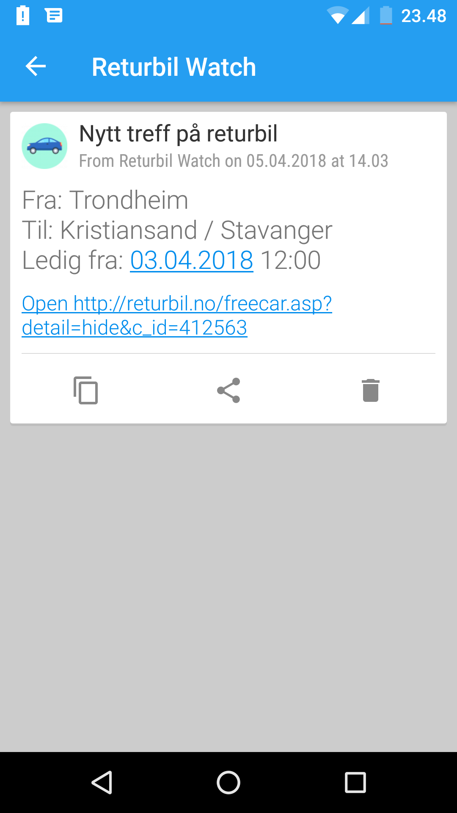

======
Returbil scanner
======

Dette python scriptet vil scanne returbil.no etter aktuelle biler etter en
forhåndsdefinert *fra by* og *til by*. Hvis et funn blir gjort vil den sende
en push-notifikasjon til mobilen din.

Installasjon
===========
- programmet krever at appen *pushover* er installert på mobilen din
  https://pushover.net/
- fra denne siden vil då få *app token* og *user key*
- klon eller last ned alle filene fra denne github-repoen
- krever at python er installert på din datamaskin

Bruk
============
Kjør følgende kommando for å starte scriptet::

  python check_forever.py fra til -app APP_TOKEN -usr USER_KEY

Hvor du bytter ut fra, til, APP_TOKEN og USER_KEY med dine egne verdier.

Hjelp
=====

For å vise hjelpeinformasjonen kjør::

    > python check_forever.py -h
    usage: check_forever.py [-h] [-i INTERVAL] [-app APP_TOKEN] [-usr USER_TOKEN]
                            FROM TO

    Check returbil.no for cars

    positional arguments:
      FROM             The city to travel from
      TO               The city to travel to

    optional arguments:
      -h, --help       show this help message and exit
      -i INTERVAL      interval time for check in seconds (default 60)
      -app APP_TOKEN   the pushover app token (default secret)
      -usr USER_TOKEN  the pushover user token (default secret)

